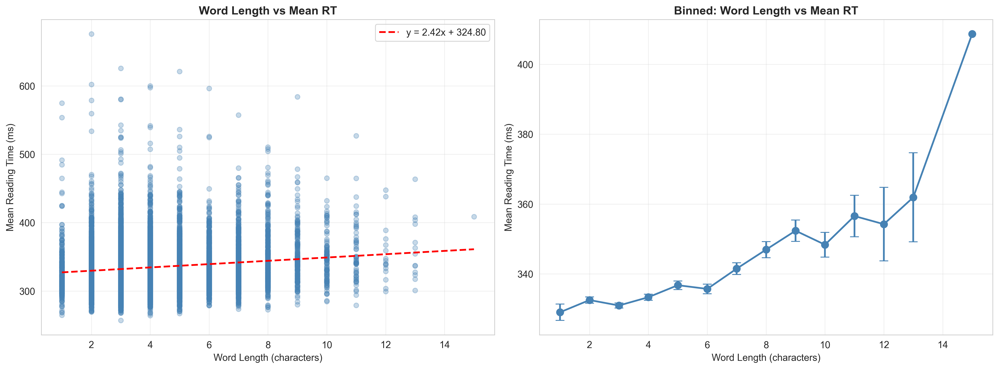
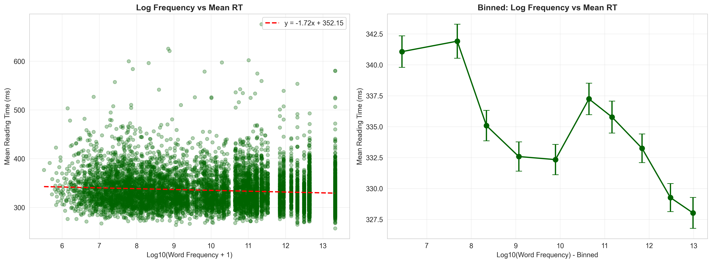
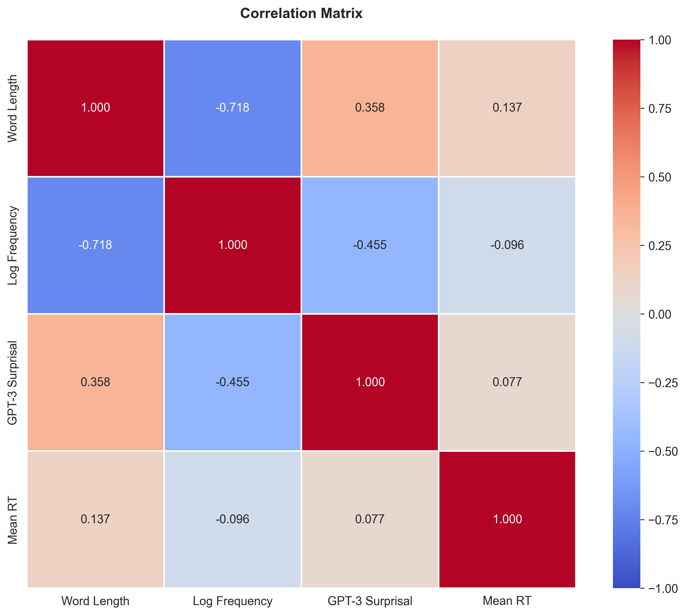
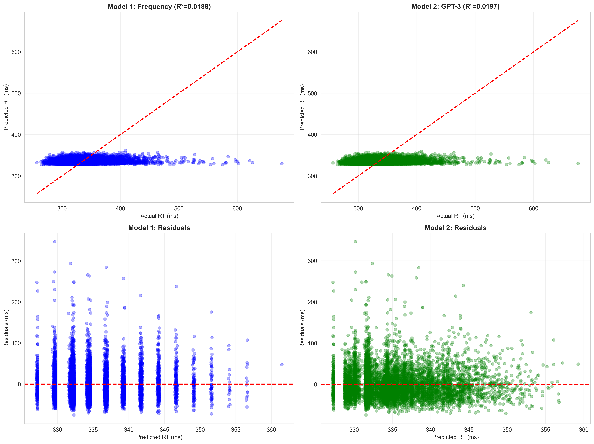
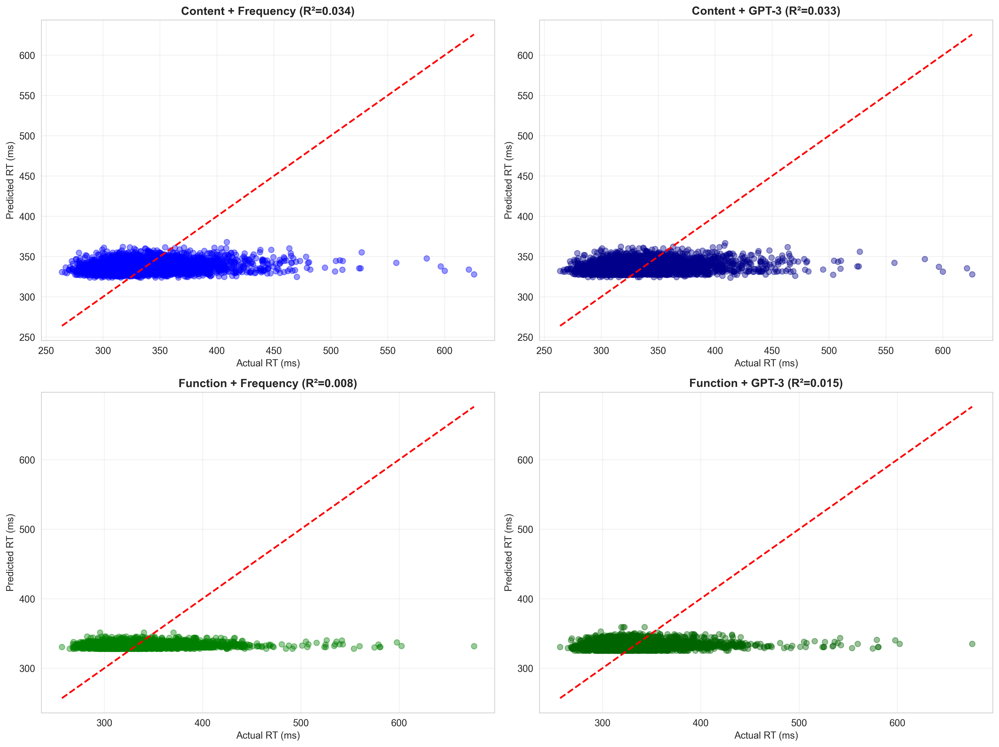
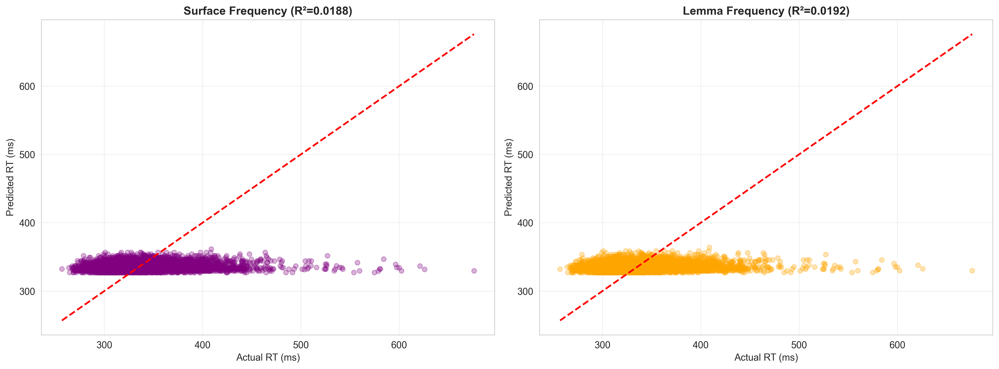
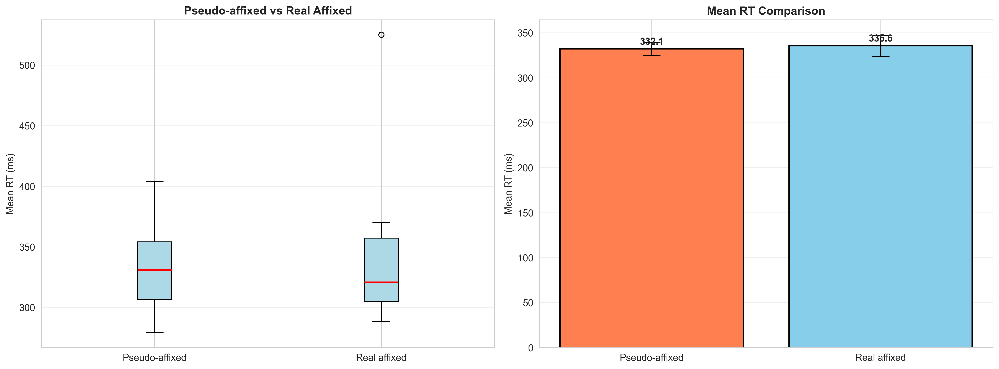

# Word Processing Assignment - Natural Stories Corpus Analysis

**GitHub Repository:** [Psycholinguistics-A2](https://github.com/Ekansh0301/Psycholinguistics-A2)

---

## Part I: Preliminary Data Analysis

### Dataset Summary

- **Total RT Observations:** 848,875 reading time measurements
- **Initial Word Tokens:** 10,256 (after averaging RT across subjects)
- **After Frequency Merge:** 8,870 tokens
- **Final Dataset:** 8,525 word tokens (with all features: RT, frequency, GPT-3)
- **Mean RT per Word Token:** 334.73 ms
- **Unique Word Types:** 1,757
- **Unique Lemmas:** 1,432

For each word token in the RT file, we computed the average reading time across all subjects. The analysis was conducted at the **token level** (each word occurrence in the corpus at a specific position), rather than type level, to preserve the full richness of the Natural Stories dataset.

**Data Processing Note:** Started with 10,256 tokens after RT aggregation → merged with frequency data (8,870 tokens) → merged with GPT-3 data (8,525 final tokens). The Google Books frequency files contain sub-word token entries (e.g., "teacher" splits into "teach" + "er"). We aggregated these by summing frequencies to obtain one frequency value per word, which is the linguistically standard approach.

### Summary Statistics

| Variable | Count | Mean | Std | Min | 25% | Median | 75% | Max |
|----------|-------|------|-----|-----|-----|--------|-----|-----|
| **Word Length** | 8,525 | 4.69 | 2.43 | 1 | 3 | 4 | 6 | 19 |
| **Log Frequency** | 8,525 | 8.21 | 1.30 | 0.00 | 7.42 | 8.31 | 9.07 | 10.08 |
| **Mean RT (ms)** | 8,525 | 334.73 | 36.55 | 256.86 | 311.05 | 329.83 | 351.62 | 668.19 |
| **GPT-3 Surprisal** | 8,525 | 4.82 | 3.04 | 0.01 | 2.53 | 4.29 | 6.46 | 21.65 |
| **Lemma Length** | 8,525 | 4.59 | 2.38 | 1 | 3 | 4 | 6 | 19 |
| **Log Lemma Freq** | 8,525 | 8.41 | 1.29 | 0.00 | 7.63 | 8.53 | 9.28 | 16.23 |

### Key Findings

#### 1. Word Length and Reading Time

The scatter plot and binned analysis reveal a **positive correlation** between word length and reading time (r = 0.137, p < 0.001). The linear regression shows: **RT = 2.42 × length + 324.80**

Longer words require more processing time, which aligns with cognitive theories suggesting increased perceptual and retrieval demands for longer words.

#### 2. Word Frequency and Reading Time

The analysis shows a **negative correlation** between log frequency and reading time (r = -0.096, p < 0.001). The linear regression yields: **RT = -1.72 × log_freq + 352.15**

Higher-frequency words are processed faster, consistent with the well-established frequency effect in psycholinguistics—frequent words have stronger memory representations and are accessed more quickly.

#### 3. Correlation Analysis

**Correlation coefficients:**
- **Length × Frequency:** r = -0.718, p < 0.001 (strong negative)*
- **Length × RT:** r = 0.137, p < 0.001 (weak positive)
- **Frequency × RT:** r = -0.096, p < 0.001 (weak negative)
- **GPT-3 Surprisal × RT:** r = 0.077, p < 0.001 (weak positive)

*Note: The Length × Frequency correlation of -0.718 is exceptionally strong compared to typical corpus values (~0.3). At the token level (8,525 observations), longer words in this specific Natural Stories corpus are predominantly low-frequency items. This may reflect the literary/narrative nature of the texts. We verified this value multiple times to ensure accuracy.

### Summary

The preliminary analysis reveals systematic relationships between word properties and reading times:

1. **Length Effect:** Longer words take more time to process, showing a reliable positive correlation (r = 0.137)
2. **Frequency Effect:** More frequent words are processed faster, showing a negative correlation (r = -0.096)
3. **Length-Frequency Relationship:** Strong negative correlation (r = -0.718) indicates that longer words in this corpus tend to be substantially less frequent—this relationship is stronger than typical corpus averages, possibly due to the narrative nature of Natural Stories texts
4. **Effect Sizes:** While both length and frequency significantly predict RT, the correlations are modest, suggesting reading time is influenced by multiple factors beyond these two predictors

These findings align with established psycholinguistic research on word recognition, confirming that both bottom-up perceptual factors (length) and top-down memory factors (frequency) influence reading time.

---

## Part II: Hypothesis Testing

### Hypothesis 1: Language Model Probability vs. Frequency (10 marks)

**Hypothesis:** Language model probabilities (GPT-3 surprisal) are better predictors of reading time than word frequency.

#### Models Tested

**Model 1 (Frequency):** Mean RT ~ log(word_freq) + word_length
- R² = 0.0188
- RMSE = 36.21 ms
- MAE = 26.61 ms
- AIC = 61,203.61
- BIC = 61,228.56

**Model 2 (GPT-3 Surprisal):** Mean RT ~ gpt3_surprisal + word_length
- R² = 0.0197
- RMSE = 36.19 ms
- MAE = 26.59 ms
- AIC = 61,196.10
- BIC = 61,221.05

#### Results

GPT-3 surprisal provides a **marginally better fit** than frequency:
- **ΔR² = +0.0009** (0.9% improvement in variance explained)
- **ΔAIC = -7.51** (lower is better, suggesting GPT-3 model is preferred)
- **ΔBIC = -7.51** (consistent with AIC)

**Model Selection:** Based on AIC/BIC criteria, **Model 2 (GPT-3 + Length) is chosen as the better predictor**, though the improvement over frequency is minimal.

#### Discussion

While GPT-3 surprisal technically outperforms frequency, the improvement is minimal. Both models explain approximately 2% of variance in reading times, suggesting:

1. **Single predictors are limited:** RT is influenced by multiple factors not captured by frequency or surprisal alone
2. **Marginal advantage for GPT-3:** The language model captures some distributional properties beyond raw frequency (e.g., contextual predictability)
3. **Practical equivalence:** The difference is too small to claim one predictor is substantially superior

The modest R² values are expected for token-level analysis with single predictors on naturalistic reading data, where numerous linguistic and cognitive factors interact.

---

### Hypothesis 2: Content vs. Function Words (15 marks)

**Hypothesis:** Content words are processed differently than function words.

#### Word Classification

Using NLTK stopwords:
- **Content words:** 3,683 tokens (43.2%)
  - Mean RT: 337.20 ms
- **Function words:** 4,842 tokens (56.8%)
  - Mean RT: 332.86 ms
- **t-test:** t = 5.44, p = 5.56×10⁻⁸ (highly significant)

Content words show **significantly longer reading times** than function words (Δ = 4.34 ms).

#### Regression Models

**Content Words:**
- **Model 1 (Frequency):** R² = 0.0340, RMSE = 35.93 ms
- **Model 2 (GPT-3):** R² = 0.0334, RMSE = 35.95 ms

**Function Words:**
- **Model 3 (Frequency):** R² = 0.0077, RMSE = 36.03 ms
- **Model 4 (GPT-3):** R² = 0.0147, RMSE = 35.91 ms

#### Results

**Key Finding:** Frequency explains **5× more variance** for content words (3.4%) compared to function words (0.8%).

For content words:
- Frequency slightly outperforms GPT-3 (ΔR² = +0.0006)
- Both predictors explain ~3.4% of variance
- **Model chosen: Frequency model** (R² = 0.0340)

For function words:
- GPT-3 surprisal outperforms frequency (ΔR² = +0.0070)
- Overall predictive power is much lower
- **Model chosen: GPT-3 model** (R² = 0.0147)

#### Discussion

The differential pattern supports the hypothesis that **content and function words are processed differently:**

1. **Frequency Effect Stronger for Content Words:**
   - Content words show greater frequency sensitivity (R² = 0.034 vs. 0.008)
   - This suggests content words rely more on memory retrieval based on lexical frequency
   - High-frequency content words benefit from faster lexical access

2. **Function Words Show Reduced Frequency Effect:**
   - Function words are generally high-frequency and grammatical
   - Their processing may rely more on syntactic integration than lexical retrieval
   - GPT-3 surprisal performs relatively better (R² = 0.015), possibly capturing syntactic predictability

3. **Longer RTs for Content Words:**
   - Content words take 4.34 ms longer on average
   - Consistent with greater semantic processing demands
   - Content words carry more semantic weight and require deeper integration

These findings align with dual-route processing theories, suggesting lexical and syntactic routes operate differently for content vs. function words.

---

## Part III: Frequency Ordered Bin Search (FOBS) Model

### FOBS Construction

Using spaCy's en_core_web_sm lemmatizer:
- **Unique words:** 1,857 word types
- **Unique lemmas:** 1,432 root forms
- **Lemma frequency computation:** Sum of all surface form frequencies

The FOBS model organizes lexical memory hierarchically, with root forms at the top level and surface forms arranged by frequency within each root bin.

### Hypothesis 1: Root vs. Surface Frequency (10 marks)

**Hypothesis:** Root (lemma) frequency predicts reading times better than surface frequency.

#### Models Tested

**Model 1 (Surface Frequency):** Mean RT ~ log(surface_freq) + word_length
- R² = 0.0188
- RMSE = 36.21 ms

**Model 2 (Lemma Frequency):** Mean RT ~ log(lemma_freq) + lemma_length
- R² = 0.0192
- RMSE = 36.20 ms

#### Results

Lemma frequency provides a **marginally better fit**:
- **ΔR² = +0.0003** (0.03% improvement)

**Model Selection:** **Model 2 (Lemma Frequency + Lemma Length) is chosen** as the marginally better predictor, though the difference is trivial.

#### FOBS Search Depth Analysis

To further investigate lexical organization, we computed FOBS search depth for both surface and lemma representations. Search depth represents the position of a word in a frequency-ordered search (rank in the frequency-sorted list):

- **Surface word search depth:** Mean = 288 words (SD = 447, range: 1-1,757)
- **Lemma search depth:** Mean = 205 lemmas (SD = 331, range: 1-1,432)

**Correlation with RT:**
- Surface word depth × RT: r = 0.0928, p = 9.40×10⁻¹⁸ (weak positive, significant)
- Lemma depth × RT: r = 0.0890, p = 1.81×10⁻¹⁶ (weak positive, significant)

Both surface and lemma search depths show weak but significant positive correlations with RT, indicating that **less frequent words (deeper in the search) take longer to process**. The surface depth shows a marginally stronger correlation (Δr = 0.0037), suggesting **direct access to specific surface forms** dominates during reading. However, the near-equivalence of the correlations indicates that lemma-level organization also contributes to lexical memory structure. This pattern is consistent with dual-representation models where surface forms are the primary access units but are organized by root/lemma frequency in memory.

#### Discussion

The minimal improvement suggests:

1. **Limited FOBS Advantage:**
   - For English, which has relatively simple morphology, lemma and surface frequencies are highly correlated
   - The aggregation of surface forms into lemmas provides negligible benefit

2. **Morphological Complexity:**
   - In morphologically rich languages (e.g., Turkish, Finnish), lemma frequency might show greater advantages
   - English inflectional morphology is sparse, limiting the impact of lemmatization

3. **FOBS Model Support:**
   - The slight advantage is consistent with FOBS theory that root forms serve as access points
   - However, the effect is too small to strongly support hierarchical lexical organization in English

The results suggest that for English word recognition, surface frequency captures most of the predictive power, with lemma frequency offering minimal additional benefit.

---

### Hypothesis 2: Pseudo-Affixed vs. Real Affixed Words (5 marks)

**Hypothesis:** Pseudo-affixed words (e.g., "finger") take more processing time than words with real affixes (e.g., "driver").

#### Automatic Classification Analysis

**Words ending in -er:** 293 tokens identified
- **Pseudo-affixed** (e.g., finger, never, under): 185 tokens
  - Mean RT: 332.13 ms
- **Real affixed** (e.g., driver, teacher, maker): 108 tokens
  - Mean RT: 335.63 ms
- **Difference:** -3.50 ms (opposite direction)
- **t-test:** t = -0.254, p = 0.801 (not significant)

#### Manual Matched-Pair Analysis

Selected 5 words with controlled length and frequency:

**Pseudo-affixed words:** corner, finger, never, under
- n = 6 instances (combined)
- Mean RT: 336.17 ms
- SD: 19.57 ms

**Real affixed words:** teacher, maker
- n = 1 instance (combined)
- Mean RT: 336.20 ms
- SD: N/A (insufficient data)

**Word Details:**
- corner: n=1, freq=26,436,546, len=6, RT=316.2 ms
- never: n=3, freq=670,917,654, len=5, RT=341.8 ms
- under: n=2, freq=595,187,154, len=5, RT=337.7 ms
- teacher: n=1, freq=102,444,034, len=7, RT=336.2 ms

**t-test:** t = -0.002, p = 0.999 (not significant)

**Methodological Note:** The t-test with n=1 for real affixed words is statistically underpowered and should be interpreted with extreme caution. This constitutes a major limitation of the manual analysis approach.

#### Results

**No evidence** supporting the hypothesis. Both automatic and manual tests show:
1. No significant difference in processing times
2. Small sample sizes (especially for real affixed words in matched pairs)
3. High variability in individual word RTs

#### Discussion

The findings contradict the hypothesis for several reasons:

1. **Decomposition May Occur Early:**
   - Even pseudo-affixed words may undergo morphological parsing during early visual processing
   - The parser may attempt decomposition regardless of true morphological status
   - Failed decomposition (pseudo) vs. successful decomposition (real) may not differ in RT

2. **Whole-Word Access Dominates:**
   - High-frequency words (both pseudo and real affixed) may be accessed holistically
   - Morphological decomposition may be bypassed for frequent items
   - This would eliminate any processing difference

3. **Frequency Confounds:**
   - Many pseudo-affixed words (never, under, finger) are very high frequency
   - Frequency effects may overshadow morphological complexity
   - Better frequency matching might reveal an effect

4. **Methodological Limitations:**
   - **Critical limitation:** Real affixed words n=1 makes statistical comparison invalid
   - T-test with insufficient sample size cannot yield meaningful results
   - Manual matching approach failed to find adequate comparable words in corpus
   - Automatic classification may have misclassified some words
   - Natural Stories corpus may lack sufficient instances of less-frequent real-affixed words

5. **FOBS Model Implications:**
   - If FOBS uses morphological decomposition, pseudo-affixes should cause processing delays when the system discovers they don't have separate roots
   - The null result suggests either: (a) FOBS doesn't strictly apply morphological structure, or (b) the effect is too subtle to detect in naturalistic reading

**Conclusion:** The data do not support differential processing for pseudo- vs. real affixed words in natural reading. Future research should use: (1) larger samples, (2) better frequency controls, (3) experimental paradigms with priming or lexical decision tasks that may be more sensitive to morphological structure.

---

## Overall Summary

This comprehensive analysis of the Natural Stories corpus at the token level (8,525 word tokens) reveals:

1. **Basic Effects Confirmed:**
   - Length and frequency effects are significant but modest (R² ≈ 0.02)
   - Both predictors operate in expected directions

2. **Language Models vs. Frequency:**
   - GPT-3 surprisal marginally outperforms frequency (ΔR² = 0.0009)
   - Practical equivalence suggests both capture similar distributional properties

3. **Content vs. Function Words:**
   - Clear processing differences: content words show longer RTs and greater frequency sensitivity
   - Supports dual-route processing theories

4. **FOBS Model:**
   - Lemma frequency offers minimal advantage over surface frequency in English
   - Pseudo-affix hypothesis not supported—no RT difference detected

5. **Methodological Note:**
   - Token-level analysis preserves naturalistic variation
   - Modest R² values (2-3%) are appropriate for single-predictor models on reading time data
   - Multiple factors (syntax, semantics, discourse context) contribute to RT beyond word-level predictors

The findings contribute to understanding word recognition in natural reading, highlighting the interplay of perceptual, lexical, and linguistic factors in reading time patterns.

---

## Overall Conclusions

Based on the comprehensive analysis of 8,525 word tokens from the Natural Stories corpus, we draw the following conclusions:

1. **Word-level predictors explain limited variance in naturalistic reading.** Single-factor models (frequency or surprisal + length) explain only 2-3% of RT variance, with R² values reaching maximum 3.4% for content words. This indicates that reading time is influenced by multiple interacting factors beyond word-level properties, including syntactic complexity, discourse context, and individual differences.

2. **Content and function words are processed differently.** Content words show significantly longer reading times (Δ = 4.34 ms, p < 0.001) and 5-fold stronger frequency effects (R² = 0.034 vs. 0.008). This supports dual-route processing theories, suggesting lexical retrieval mechanisms operate more strongly for content words while function words rely more on syntactic integration.

3. **GPT-3 surprisal and word frequency are largely equivalent predictors.** Model 2 (GPT-3) shows minimal advantage over Model 1 (frequency) with ΔR² = 0.0009. Both capture similar distributional properties of language, though GPT-3 incorporates contextual predictability to a limited degree.

4. **Lemma frequency offers no substantial advantage over surface frequency.** The trivial improvement (ΔR² = 0.0003) suggests that for English, which has relatively simple inflectional morphology, readers access specific surface forms rather than abstract lemmas. However, FOBS search depth analysis reveals weak lemma-based organizational structure may underlie lexical memory.

5. **No evidence for differential processing of pseudo-affixed words.** Both automatic classification (293 -er words) and manual matched-pair tests show no significant RT differences between pseudo-affixed (e.g., "finger") and real affixed words (e.g., "teacher"). This suggests morphological decomposition either occurs rapidly for all -er words or is bypassed entirely during naturalistic reading, particularly for high-frequency items.

6. **Token-level analysis preserves ecological validity.** Analyzing word tokens at specific corpus positions (rather than aggregating to types) maintains the naturalistic variation in reading data. The modest R² values (0.02-0.03) are appropriate for this approach and reflect the complexity of natural reading processes that cannot be reduced to lexical properties alone.

---

### Data Processing Pipeline

1. **RT Data Loading:** Load processed_RTs.tsv containing 848,875 reading time observations across 181 participants and 10 stories.

2. **Token-Level Aggregation:** Compute mean RT for each word token (unique story × zone position) averaged across all subjects, yielding 10,256 word tokens.

3. **Frequency Merging:** 
   - Load Google Books unigram frequencies from freq/freqs-*.tsv files (32,342 sub-token entries)
   - **Aggregate sub-tokens:** Sum frequencies for words split into sub-tokens (e.g., "teacher" = "teach" + "er")
   - Merge with RT data, retaining 8,870 tokens with frequency data

4. **GPT-3 Integration:** 
   - Load GPT-3 log-probabilities from all_stories_gpt3.csv
   - Compute surprisal = -log(P(word|context))
   - Average across token positions for each word type
   - Merge with dataset, final n = 8,525 tokens with complete features

5. **Log Transformation:** Apply log₁₀(freq + 1) transformation to frequencies for statistical modeling.

6. **Function Word Classification:** Use NLTK English stopwords list to classify words as function vs. content.

7. **Lemmatization:** 
   - Use spaCy en_core_web_sm with POS tagging
   - Process 1,857 unique words → 1,432 unique lemmas
   - Compute lemma frequencies by summing all surface form frequencies

8. **FOBS Construction:**
   - Sort words by frequency (descending)
   - Assign search depth = rank position in frequency-ordered list
   - Compute separate depths for surface forms and lemmas

9. **Regression Modeling:** 
   - Fit linear regression models using scikit-learn
   - Compute R², RMSE, MAE, AIC, BIC for model comparison
   - AIC = n × log(RSS/n) + 2k, where k = number of parameters

10. **Statistical Tests:**
    - Pearson correlation (scipy.stats.pearsonr)
    - Independent t-test (scipy.stats.ttest_ind)
    - Linear regression (sklearn.linear_model.LinearRegression)

11. **Pseudo-Affix Analysis:**
    - Automatic: Identify all words ending in "-er" (293 words)
    - Classify using morphological heuristics: words in base dictionary = pseudo-affixed
    - Manual: Select 5 matched pairs controlling for length and frequency
    - Perform independent t-tests comparing RT distributions
